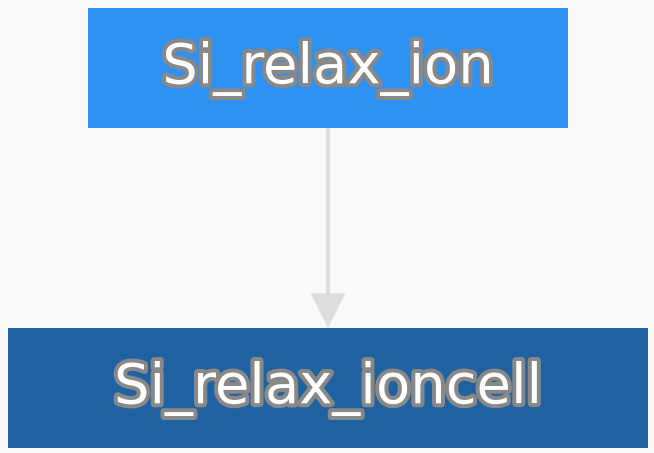
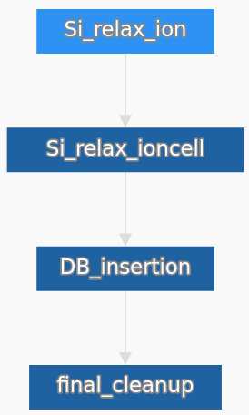
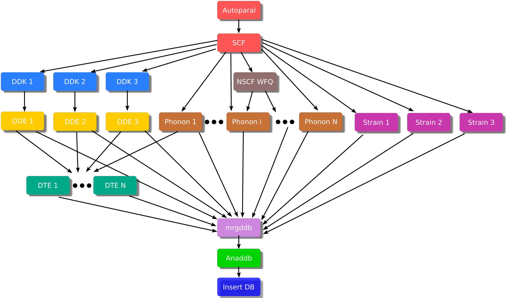

.. _workflows:

================
Abinit Workflows
================

General philosophy
==================

Abiflows provides a set of workflows generating objects that can be used to create
Fireworks ``Workflow`` objects that can be than inserted into the MongoDB database
with the Fireworks ``LaunchPad``.

A Fireworks' workflow is obtained composing different Fireworks and Firetasks.
Abiflows has implemented all the logic necessary to interact at the lower level
with Abinit, in order to generate input, read outputs and correct the errors.
As a consequence, in general, the user should not be concerned to access the components
objects and should rely on the higher level interface.

The workflows implemented in Abiflows have been purposely kept as simple as possible,
performing the minimal set of operations to calculate a specific property or a set of them.
The philosophy adopted for the general procedure is that the procedure should be split
in its components and different workflows should be generated to reach the final set
of results. As an example, consider to start from an unrelaxed structure
and aiming to obtain its electronic band structure. The standard procedure will require to first
run a workflow to relax the structure. The output will be automatically stored in a
MongoDB database and the relaxed structure can then be used as a starting point for
a band structure workflow.

This approach has been chosen because Abiflows has been designed to run Abinit calculations in
the high-throughput regime. In general complicated workflow that try to different kinds
of results running several calculation are more error prone and less likely to
produce a final result. Dividing the procedure in smaller, logically independent chunks
allows to obtain the results in more than one step, each one acting as a sort of checkpoint,
since its output is stored in a results database. In the case of failure in the subsequent steps
(the calculation of the electronic band structure in the previous example) a new workflow can be
generated starting from the relaxed structure obtained in output from the relaxation workflow.

Workflows generators
====================

Instantiating a generator
-------------------------

In general the workflow generator in Abiflows takes as input one or more
``AbinitInput`` or ``InputFactory`` objects coming from Abipy. These will completely
define the inputs used for Abinit in the calculation for the specific workflow that
will be generated.

In addition it usually accepts the following arguments:

* ``autoparal``: a boolean to decide if the parallelization should be decided
  automatically using the Abinit autoparal feature in combination with the
  Abipy task manager.
* ``spec``: a dictionary that will be added to the ``spec`` of all the generated
  Fireworks.
* ``initialization_info``: a dictionary with information about the workflow.
  This is added to the spec of the Fireworks in the workflow to ease the queries
  and some keywords will usually be stored in the final database document
  produced by the workflow. See the :ref:`results_db` section for more details.

Once created, a workflow generator instance contains a fireworks ``Workflow`` object
as an attribute under the name ``wf``. This can then be added to the fireworks database
so that it can be executed.

Creating an instance of a Workflow generator from the ``__init__`` method could
be a choice if you would like to have the largest possible control on the inputs
that will be used to run the calculations.

A more direct approach is instead to use the ``from_factory`` classmethod to
instantiate the object. This will make use of the factory functions implemented
in the ``abipy.abio.factories`` module to automatically create all the required
inputs for the workflow, based on a minimal set of parameters.

As an example let us consider the ``ScfFWWorkflow`` object. The ``from_factory``
method reads like this:

.. code-block:: python

    @classmethod
    def from_factory(cls, structure, pseudos, kppa=None, ecut=None, pawecutdg=None, nband=None, accuracy="normal",
                     spin_mode="polarized", smearing="fermi_dirac:0.1 eV", charge=0.0, scf_algorithm=None,
                     shift_mode="Monkhorst-Pack", extra_abivars=None, decorators=None, autoparal=False, spec=None,
                     initialization_info=None):

As you can see, the main input that should be provided are a pymatgen ``Structure``
describing the system and a list of pseudopotentials. Other options like the number
of k-points and the smearing can be defined through a set of meta parameters, while
some others will directly set the values of some options in the Abinit input.

The ``extra_abivars`` is a dictionary that can be used to set the value of any arbitry
Abinit variable in all the inputs produced. In addition it allows to pass the other
arguments mentioned above for the ``__init__``.

Similar methods can be found for the other workflows available, with additional arguments
specific to the type of calculations that should be performed.

In some cases, since some workflows might be expected to be the natural continuation
of other gs calculation (e.g. a phonon calculation is usually following a relaxation
of the structure) a ``from_gs_input`` classmethod can also be used to instantiate the
workflow generator. With these method the user can directly use the input used for a
previous ground state calculation as a starting point for the workflow, directly
preserving all the options that were set in the previous step.

Note that when using the ``from_gs_input`` method the same pseudopotentials will be
used, so they have to be in the same path as they were during the execution of the
previous workflow. In addition all the keyword relative to the relaxation and the
parallelization will be discarded, as they are expected to be unsuitable for the
workflow.

Helper methods
--------------

Additional methods are available to all the generators that help to further customize
the workflow that is being generated. These can be found as methods of the ``AbstractFWWorkflow``
abstract base class from which all the generators inherit and here are a list of the
more useful:

**add_mongoengine_db_insertion**: appends a Firework to the Workflow that will insert the
results of the workflow in a MongoDB database.

**add_final_cleanup**: appends a Firework to the Workflow that will remove the selected
files from all the folders in which the Abinit calculations have been executed.

**add_to_db**: given a ``LaunchPad`` insert the workflow in the fireworks database.

**add_metadata**: Adds metadata to the workflow in the fireworks database.

**fix_fworker**: sets a fireworker for all the Fireworks of the Workflow, so that even
automatically generated detours will run in the same fireworker.

.. _examples_wf:

Examples
========

Here we describe the main parts of a python script that can be used to submit a relaxation
and a phonon calculation. More complete and commented scripts can be found in the
``abiflows.fireworks.examples`` folder. You are encouraged to check those examples for
more details.

Relax structure
---------------

The following lines of code allow to create a Workflow for the relaxation of Si and add it
to the fireworks database.

.. code-block:: python

    structure = Structure.from_file("Si.cif")
    pseudo_djson = os.path.join(pseudo_dojo.dojotable_absdir("ONCVPSP-PBE-PDv0.4"), 'standard.djson')
    pseudo_table = pseudo_dojo.OfficialDojoTable.from_djson_file(os.path.join(pseudo_djson))

    gen = RelaxFWWorkflow.from_factory(structure, pseudo_table, kppa=1500, spin_mode="unpolarized",
                                       autoparal=True, target_dilatmx=1.01, smearing=None,
                                       shift_mode='OneSymmetric')

    db = DatabaseData(host='db_address', port=27017, collection='collection_name',
                      database='db_name', username='user', password='pass')

    gen.add_mongoengine_db_insertion(db)
    gen.add_final_cleanup(["WFK", "1WF", "DEN", "WFQ", "DDB"])

    gen.add_to_db()

As a first step the essential information are gathered, i.e. the geometry of the system, in the
form of a pymatgen ``Structure`` and the table of pseudopotentials. Note that the whole table
of pseudopotentials with their hints about energy cutoff is imported here. The factory function
will sort out which are the needed pseudopotentials automatically.

From these inputs an instance of ``RelaxFWWorkflow`` is generated using  the ``from_factory``
classmethod, that allows to rely on the ``abipy.abio.factories.ioncell_relax_from_gsinput``
factory function.

At this point the generator already contains an instance of a fireworks ``Workflow`` with
two Fireworks, one that will perform first a relaxation of the atomic positions alone and
a second that will relax both the atomic positions and the cell size and shape:

The lines that come next define the connection to the database of the results and pass it to
the ``add_mongoengine_db_insertion`` helper function so that an additional Firework is added
to the workflow for the insertion of the results in the final database. More details can
be found in the :ref:`results_db` section.

.. note::

    If the ``add_mongoengine_db_insertion`` is not called the workflow will not store the
    results in any database.

After that the ``add_final_cleanup`` to specify a list of extensions that will be used to
determine which files need to be removed from all the folders of the workflow. At this point
the fireworks ``Workflow`` has this structure:

.. warning::
    At this point nothing has been added to the fireworks database. Only an instance of the object
    has been created and is stored inside the generator. If the script had stopped here no
    calculation would have been inserted in the fireworks database.

The last line takes care of adding the ``Workflow`` in the fireworks database. In this case it will
use the default ``LaunchPad`` defined in ``$HOME/.fireworks``.

Phonons
-------

Here we will consider the usual case of submitting a workflow to calculate the phonons following
a relaxation, calculated with a workflow as in the previous section. The core part of a script
to create such a workflow is as follows

.. code-block:: python

    source_db = DatabaseData(host='db_address', port=27017, collection='collection_name',
                             database='db_name', username='user', password='pass')
    db = DatabaseData(host='db_address', port=27017, collection='collection_name_2',
                      database='db_name', username='user', password='pass')

    with source_db.switch_collection(RelaxResult) as RelaxResult:
        relaxed = RelaxResult.objects(mp_id=mp_id)[0]

        structure = Structure.from_dict(relaxed.abinit_output.structure)

        ngkpt = relaxed.abinit_input.ngkpt

        relax_input = relaxed.abinit_input.last_input.to_mgobj()

    gen = DfptFWWorkflow.from_gs_input(structure=structure, gs_input=relax_input, autoparal=True,
                                       do_ddk=True, do_dde=True, ph_ngqpt=ngkpt, do_strain=False)

    gen.add_mongoengine_db_insertion(db)
    gen.add_final_cleanup(["WFK", "1WF", "WFQ", "1POT", "1DEN"])

    gen.add_to_db()

In this case the source of all the information (structure, pseudopotentials and kinds of approximations)
is the database containing the results of the relax workflow. The relevant data are thus retrieved
from the database using a query with mongoengine (see the :ref:`results_db` section for more details).
In particular the Abinit input used for the relaxation is retrieved in its JSON-serialized form
and converted to an instance of the `AbinitInput` object.

At this point the ``from_gs_input`` method from the ``DfptFWWorkflow`` is used to generate the
phonon ``Workflow`` based on the inputs provided from the relax calculation. The structure should
be passed, since the input from the previous calculation contains the unrelaxed structure,
while we of course are interested in the phonons for the relaxed one.

.. warning::

    The ``DfptFWWorkflow`` workflow generates uses the ``abipy.abio.factories.dfpt_from_gsinput``
    factory function to generate all the required perturbations. To do this Abinit is called in the
    background to determine the minimal set of perturbations that need to be calculated. To do this
    Abinit should available through the task manager to Abipy. An instance of the ``TaskManager``
    can be passed to the ``from_gs_input`` and ``from_factory`` methods, if needed.

The last steps are the same as in the previous example, except for the list of files that needs
to be cleaned up.

Workflows list
==============

Here we present a list of the workflows available in Abiflows with a short description.

SCF
---

Generator: :class:`abiflows.fireworks.workflows.abinit_workflows.ScfFWWorkflow`.

A simple workflow composed by a single self-consistent calculation.

SCF + NSCF
----------

Generator: :class:`abiflows.fireworks.workflows.abinit_workflows.NscfFWWorkflow`.

A workflow composed by two Fireworks, the first performing a self-consistent calculation
and the second a non-self-consistent one based on the density calculated in the first
step.

Generic input
-------------

Generator: :class:`abiflows.fireworks.workflows.abinit_workflows.InputFWWorkflow`.

A simple workflow composed by a single step that runs abinit with the specified ``AbinitInput``
object, that could contain an arbitrary input.

Relax
-----

Generator: :class:`abiflows.fireworks.workflows.abinit_workflows.RelaxFWWorkflow`.

A workflow to perform the geometry optimization of a structure. By default it will be
composed by two steps: the first relaxes only the atomic positions and the second
relaxes both the atomic position and the cell size and shape.

The first step could be disabled and the workflow also allows to specify a final value
for ``dilatmx``. This will trigger the generation of additional steps in the workflow
until the structure is relaxed with the specified value of ``dilatmx``.

Phonons
-------

Generators: :class:`abiflows.fireworks.workflows.abinit_workflows.PhononFWWorkflow`,
:class:`abiflows.fireworks.workflows.abinit_workflows.PhononFullFWWorkflow`.

A workflow to perform the calculation of phonons on a list or on a regular grid of q-points.
First a SCF calculation is performed to obtain the wave functions and then all the different
perturbations are calculated. NSCF calculation to obtain the wave functions at K+Q (WFQ files)
will be automatically generated, if needed. The results are finally collected in a single
DDB file using ``mrgddb``.

The workflow also allow to calculate the perturbations with respect to the electric field,
that are required to obtain the correct LO-TO splitting at :math:`\Gamma`.

``PhononFWWorkflow`` and ``PhononFullFWWorkflow`` differ only in the fact that the former
generates the perturbations at run time, while the latter generates them when the workflow
is generated.

The phonons can also be also calculated using the ``DfptFWWorkflow`` (see the
:ref:`dfpt_workflow` section). In the future ``DfptFWWorkflow`` may supersede
the ``PhononFWWorkflow`` generator.

DTE
---

Generator: :class:`abiflows.fireworks.workflows.abinit_workflows.DteFWWorkflow`.

Workflow that allows to calculate the third order derivatives with respect to electric field and
atomic position in DFPT to obtain the non-linear optical susceptibilities of a material.

First a SCF calculation is performed to obtain the wave functions and then all the different
perturbations are calculated. These may include the derivatives with respect to the electric
field and the phonons at :math:`\Gamma`. With these is will use the N+1 theorem to calculate
the third order derivatives. The results are finally collected in a single
DDB file using ``mrgddb``.

Note that Abinit has some limitations with respect to the approximations that can be used in this
workflow. Check if this is compatible with those that you plan to use.

The third order derivatives can also be also calculated using the ``DfptFWWorkflow`` (see the
:ref:`dfpt_workflow` section). In the future ``DfptFWWorkflow`` may supersede
the ``DteFWWorkflow`` generator.

.. _dfpt_workflow:

DFPT
----

Generator: :class:`abiflows.fireworks.workflows.abinit_workflows.DfptFWWorkflow`.

Workflow that allows to calculate most of the perturbations available in Abinit with DFPT.
In particular these include:

* first order derivatives with respect to the atomic positions.
* first order derivatives with respect to the strain.
* first order derivatives with respect to the electric field.
* third order derivatives with respect to the atomic positions and electric field.

From these it is possible to obtain the following quantities:

* phonons
* dielectric tensor
* elastic tensor
* piezoelectric tensor
* non-linear optical susceptibilities

The workflow is organized as show in the following schematic figure:

First a SCF calculation is performed to obtain the wave functions and then all the different
perturbations are calculated. NSCF calculation to obtain the wave functions at K+Q (WFQ files)
will be automatically generated, if needed. The results are finally collected in a single
DDB file using ``mrgddb``.

Limitations
===========

Having to deal with high-throughput calculations and to interact with a database to handle
the calculations necessarily leads to some limitations of the options that can be implemented
and the functionalities that can be exploited. Here we list a few limitations that you might
encounter while using Abiflows.

Pseudopotentials
----------------

The ``AbinitInput`` object needs to know the full path to the pseudopotential. So, in the
current implementation, when creating a workflow and serializing it to store it into the
fireworks database, the reference is the absolute path to the pseudopotential file.
For this reason the pseudopotentials files should not be moved during the execution of a
workflow. In addition, if you are running simulation from different clusters and
using a common fireworks database the fetching of list of Fireworks with the commands
like ``lpad get_fws`` may fail if the paths for the pseudopotentials are the same in
the two clusters.

While this does not present any problem for running workflow on several cluster at the
same time, if possible, it is preferable to have the pseudopotential stored in the
same absolute path across the different clusters.

Files accessibility
-------------------

Another limitation related to the possibility of running workflows from a single fireworks
database on different clusters is that, given their usually large size, we do not support
in any way the copy of dependency files (e.g. wavefunctions, densities) from one cluster to another.

This means that a workflow is expected to be executed on the same cluster, or at least on machines
that have access to a shared file system. For this reason, if you are using multiple clusters
without a common file system it is important to use the ``fix_worker`` helper method as
shown in the :ref:`examples_wf`. This will ensure that all the Fireworks are executed on the same
worker.

Fireworks offline mode
----------------------

The fireworks `offline mode <https://materialsproject.github.io/fireworks/offline_tutorial.html>`_
is not fully supported in Abiflows. In some tasks it is necessary to access to the fireworks
database to get global information about the whole workflow.
This is the case for example for the database insertion and the cleanup tasks.

If you are forced to run in offline mode due to constraints in your cluster connectivity you have
to make sure that at least the short jobs that run on one core are executed on a machine that can
connect to the database, like the front end. This should not have a large impact since these are
not jobs running DFT calculations.

One way of achieving this is to create two ``my_workers.yaml`` files with specific queries, e.g.:

.. code-block:: yaml

    name: worker_cluster
    category: ''
    params: null
    query: '{"$or": [{"spec._queueadapter.ntasks": {"$exists": false}}, {"spec._queueadapter.ntasks": {"$gt": 1}}]}'

.. code-block:: yaml

    name: worker_front_end
    category: ''
    params: null
    query: '{"spec._queueadapter.ntasks": 1}'

Note that using the same name for the worker here is fine as well, since the two queries do not overlap.
This might be necessary if you are using explicitly setting the name of the fworker for the all
the fireworks of the workflow.
